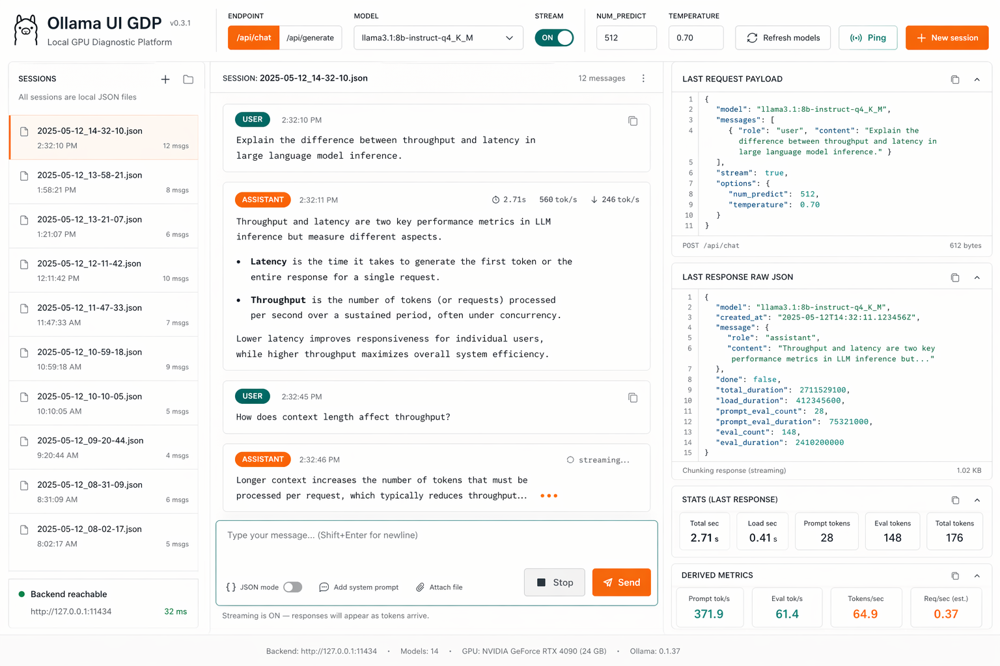

# Ollama UI Chat

A local, diagnostics-first web UI for testing and comparing Ollama models via `/api/chat` and `/api/generate`.

> Project status: **Under construction** (active v1 development).



## Why this project

`ollama-ui-chat` is built for practical model testing, not for a polished consumer chat experience. It focuses on:

- fast request iteration,
- endpoint comparison (`/api/chat` vs `/api/generate`),
- request/response transparency,
- metrics visibility,
- local JSON session persistence.

## Key features

- Single-page local UI (React + Vite).
- Local backend API (Express + TypeScript).
- Model list refresh and backend ping checks.
- Session lifecycle: create, open, delete.
- Chat execution with selectable endpoint.
- Optional request abort support.
- Diagnostics panels for:
  - last request payload,
  - last raw response,
  - stats,
  - derived metrics.
- Session files stored locally in `sessions/`.

## Architecture

- `frontend/` renders UI and calls `/backend/*`.
- `backend/` manages session files and proxies requests to Ollama.
- Ollama base URL is configurable (`config.json` or env override).
- Prompt preamble can be loaded from `AGENTS.md`.

Default local ports:

- Frontend: `http://127.0.0.1:4173`
- Backend: `http://127.0.0.1:4174`
- Ollama (default): `http://127.0.0.1:11434`

## Requirements

- Node.js 20+
- npm 10+
- `curl` (used by `run.sh` readiness checks)
- Running Ollama API (local or tunnelled)

## Quick start (recommended)

```bash
./run.sh
```

What `run.sh` does:

- ensures `sessions/` exists,
- installs dependencies if `node_modules/` is missing,
- starts backend and frontend,
- waits until both are ready,
- prints the UI URL.

Open:

- `http://127.0.0.1:4173`

Stop with `Ctrl+C`.

## Manual run

```bash
npm install
npm run dev:backend
npm run dev:frontend
```

## Configuration

Main config file: `config.json`

Important fields:

- `session_defaults.endpoint`: `/api/chat` or `/api/generate`
- `session_defaults.stream`: default streaming flag
- `session_defaults.think`: include `think` in requests
- `session_defaults.request_options`: `num_ctx`, `num_predict`, `temperature`
- `ollama.base_url`: Ollama API base URL
- `history.max_messages`: message history window
- `prompt_preamble.enabled/path/max_bytes`: preamble injection settings

Environment overrides (backend):

- `PORT` (default `4174`)
- `SESSIONS_DIR` (default `<repo>/sessions`)
- `CONFIG_PATH` (default `<repo>/config.json`)
- `OLLAMA_BASE_URL` (overrides `config.json`)

## API overview

Base prefix: `/backend`

- `GET /health`
- `GET /ollama/models`
- `GET /ollama/ping`
- `GET /sessions`
- `POST /sessions`
- `GET /sessions/:id`
- `DELETE /sessions/:id`
- `POST /sessions/:id/run`
- `POST /requests/:requestId/abort`

## Project structure

```text
.
├── frontend/                 # React UI
├── backend/                  # Express API + Ollama bridge
├── sessions/                 # Local persisted session JSON files
├── docs/                     # Product, API, and UI docs
├── config.json               # Runtime defaults
├── run.sh                    # Recommended local startup script
└── AGENTS.md                 # Optional prompt preamble source
```

## Scripts

From repository root:

- `npm run dev:frontend`
- `npm run dev:backend`
- `npm run test`
- `npm run test:frontend`
- `npm run test:backend`

## Testing

Run all tests:

```bash
npm run test
```

## Documentation

- `docs/01-product-spec.md`
- `docs/02-api-behavior.md`
- `docs/03-ui-architecture.md`

## Contributing

This project is actively evolving. Prefer small, focused pull requests with clear behavior changes and updated tests.
